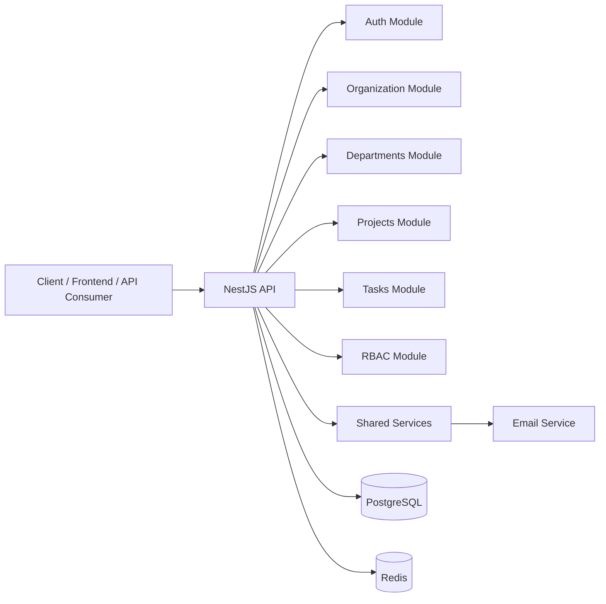
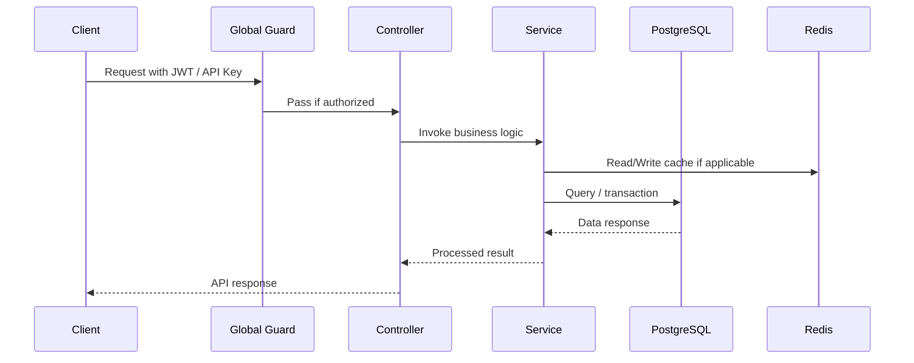

# Karmayog Backend

Karmayog is a scalable, modular, enterprise-ready backend platform for organization operations, project execution, team collaboration, and productivity management. It is designed as a modular monolith so it can start as a single deployable application while remaining easy to evolve into a distributed system later.

The system is built with NestJS and TypeScript and provides a solid foundation for multi-tenant organizations, departments, projects, tasks, subtasks, issues, comments, work logs, authentication, authorization, auditing, and future AI-powered operational workflows.

---

## 1. Project Overview

### What this project is
Karmayog is an organization operations and project execution platform aimed at helping businesses manage internal operations in a structured, visible, and accountable way.

It is meant to replace fragmented workflows such as:
- Excel-based tracking
- WhatsApp-driven coordination
- disconnected spreadsheets and manual follow-ups
- lack of centralized visibility across teams and departments

### Purpose of the project
The core purpose is to provide a single digital backbone for organizations to:
- manage departments and teams
- create and track projects
- assign and monitor tasks
- manage work logs and comments
- support organizational visibility and accountability
- enforce role-based access control and secure workflows

### Problems it solves
This application addresses several real-world operational problems:
- scattered information across multiple tools
- poor visibility into ongoing work
- lack of accountability and ownership
- unclear role-based access and permission boundaries
- inconsistent task tracking and communication
- limited reporting and operational oversight

### Why this is a scalable project
The project is structured so that it can grow in three dimensions:
1. functional growth: add new modules and business capabilities
2. team growth: multiple developers can work safely in isolated modules
3. system growth: the architecture can later evolve into microservices if needed

The modular monolith approach keeps the initial complexity manageable while giving the system long-term growth potential.

---

## 2. Current Architecture

### Architecture style
The current architecture is a Modular Monolith.

This means:
- one application is deployed as a single backend service
- the codebase is divided into logical feature modules
- modules communicate internally through services and shared abstractions
- the design is structured so future decomposition into microservices remains feasible

### Why this architecture was chosen
A modular monolith is an ideal choice for this stage because it provides:
- faster development cycles
- simpler deployment and debugging
- lower operational overhead
- strong module boundaries
- clear path to future scaling

### Architectural principles used
- separation of concerns
- feature-based modularization
- centralized configuration
- shared cross-cutting infrastructure
- dependency injection
- strong validation and guarded access

### High-level architecture diagram



### Request flow



---

## 3. Core Architectural Layers

### 1. Application Layer
This layer contains the NestJS application bootstrap and framework-level setup.
It handles:
- app initialization
- global middleware
- global pipes
- global filters
- global interceptors
- Swagger setup
- health endpoint

### 2. Common Layer
The common layer contains reusable infrastructure and cross-cutting concerns:
- decorators
- guards
- interceptors
- filters
- middlewares
- loggers

This is where authentication logic, authorization rules, request logging, and exception behavior are centralized.

### 3. Config Layer
Configuration is centralized in the config module and environment validation layer.
This provides:
- environment-driven configuration
- strong validation for required variables
- maintainable database and JWT settings

### 4. Database Layer
The database layer contains TypeORM configuration and data source management.
It is responsible for:
- database connection setup
- entity mapping
- migration preparation
- transactional data access

### 5. Modules Layer
This is the heart of the project. Each business domain is represented as a feature module such as:
- auth
- users
- organization
- departments
- rbac
- projects
- tasks
- subtasks
- issues
- comments
- work-logs

### 6. Shared Layer
The shared layer contains reusable services and infrastructure utilities such as:
- email services
- cache services
- helper utilities
- cross-module integrations

---

## 4. File and Folder Structure

```txt
src/
├── app.controller.ts
├── app.module.ts
├── app.service.ts
├── main.ts
├── common/
│   ├── decorators/
│   ├── filters/
│   ├── guards/
│   ├── interceptors/
│   ├── loggers/
│   └── middlewares/
├── configs/
│   ├── database.config.ts
│   ├── env.config.ts
│   └── redis.config.ts
├── database/
│   ├── data-source.ts
│   └── database.module.ts
├── modules/
│   ├── auth/
│   ├── comments/
│   ├── departments/
│   ├── features/
│   ├── issues/
│   ├── organization/
│   ├── projects/
│   ├── rbac/
│   ├── subtasks/
│   ├── tasks/
│   ├── users/
│   └── work-logs/
├── shared/
│   ├── cache/
│   ├── services/
│   └── utils/
``` 

### Module-level structure
Most feature modules follow a consistent convention:

```txt
module-name/
├── controllers/
├── services/
├── dto/
├── entities/
├── interfaces/
├── strategies/
├── tests/
└── module.ts
```

This keeps the codebase predictable and scalable for future contributors.

---

## 5. Tech Stack Used

### Backend
- NestJS 11
- TypeScript
- Node.js
- PostgreSQL
- TypeORM
- Redis
- JWT
- Passport
- Joi
- bcrypt
- Winston
- Swagger

### Infrastructure and DevOps
- Docker
- Docker Compose
- GitHub Actions
- Environment-based configuration
- CI pipeline for lint/test/build/docker packaging

### Development Tools
- ESLint
- Prettier
- Jest
- Supertest
- TypeScript compiler

---

## 6. Authentication and Authorization

### Authentication flow
The authentication system is centralized under the Auth module and uses:
- OTP-based sign-in flow
- JWT access token issuance
- refresh token support
- user account lockout after repeated failures
- Redis-backed OTP storage for temporary security checks

### JWT strategy
The application uses Passport-based JWT strategies for secure authentication.
This enables:
- stateless authentication
- token-based API access
- easy integration with frontend clients

### Authorization model
The project uses a Role-Based Access Control (RBAC) design with guards and decorators.

Key concepts:
- public routes can be marked as public
- protected routes require authentication
- role-based routes can be restricted using role metadata
- a composite guard handles authentication strategy selection

### Guard architecture
The project uses several guard types:
- JwtAuthGuard for JWT-based protected routes
- RolesGuard for enforcing route roles
- ApiKeyGuard for API key-based access
- CompositeAuthGuard for combining authentication layers

### Why this matters
This allows the system to safely protect resources such as:
- organization management endpoints
- departmental operations
- project and task admin flows
- sensitive user and RBAC management routes

---

## 7. Security Architecture

The backend includes multiple layers of protection:

### Security features implemented
- Helmet middleware for HTTP security headers
- CORS configuration
- global validation pipes
- global exception filter
- request logging middleware
- throttling via NestJS Throttler
- environment validation using Joi
- password hashing using bcrypt
- API key support for selected routes
- JWT-based authentication and authorization

### Security philosophy
The project follows a defense-in-depth approach:
1. validate inputs early
2. authenticate all protected routes
3. authorize using explicit role rules
4. log suspicious or erroring requests
5. use environment validation to prevent misconfiguration

---

## 8. API Documentation with Swagger

Swagger is enabled for development environments and provides interactive API documentation.

### Swagger access
- API docs: /api/docs
- API base prefix: /api
- versioned endpoints: /api/v1

### Swagger capabilities
- documented endpoints
- auth support for bearer tokens
- API key support for protected integrations
- grouped tags for auth and user-related operations

---

## 9. Docker and Containerization

### Docker usage
The project uses Docker to package the backend service and run it consistently across environments.

### Dockerfile
The Dockerfile uses a multi-stage build:
- build stage installs dependencies and compiles the NestJS app
- production stage runs the compiled application with lightweight runtime dependencies

### Docker Compose
The docker-compose file configures:
- the backend application service
- PostgreSQL database
- Redis cache

This provides a ready local infrastructure stack for development and testing.

### Typical services in compose
- app: backend runtime
- postgres: primary relational database
- redis: cache and temporary storage layer

---

## 10. CI/CD with GitHub Actions

The repository includes a GitHub Actions workflow for continuous integration.

### Current CI pipeline behavior
The workflow performs:
- checkout of repository code
- Node.js environment setup
- dependency installation
- test execution
- build verification
- Docker image build and push for main branch

This ensures that changes are checked automatically before being merged or released.

---

## 11. Design Patterns Used

The project applies several practical software design patterns:

### 1. Modular Architecture Pattern
The project is divided into domain-focused modules such as auth, users, projects, tasks, and departments.

### 2. Dependency Injection
NestJS uses constructor injection heavily throughout services and guards.

### 3. Service Layer Pattern
Controllers delegate business logic to services rather than implementing logic inline.

### 4. Repository Pattern via TypeORM
Data access is handled through TypeORM repositories and entities rather than raw SQL scattered across the application.

### 5. Strategy Pattern
Authentication uses Passport strategies for different auth mechanisms such as JWT.

### 6. Decorator-Based Metadata Pattern
Custom decorators such as public access, roles, and API key requirements are used to decorate routes and enforce behavior declaratively.

### 7. Middleware / Guard / Filter / Interceptor Pipeline
The project uses NestJS’s pipeline architecture to manage:
- request logging
- authentication
- authorization
- exception handling
- response transformation

### 8. Transaction Pattern
Critical flows such as organization registration use database transactions to maintain data consistency.

### 9. Cache-Aside Pattern
Redis is used as a cache layer for temporary and frequently accessed data.

---

## 12. Why this project is suitable for enterprise-style growth

This backend already shows the characteristics of a serious software foundation:
- modular structure
- clear separation of concerns
- centralized security
- typed configuration
- database abstraction
- testability
- container support
- CI/CD readiness

That makes it a strong base for evolving into a full SaaS platform or internal enterprise system.

---

## 13. Development Workflow

### Local development
Install dependencies:

```bash
npm install
```

Run the application:

```bash
npm run start:dev
```

### Build

```bash
npm run build
```

### Tests

```bash
npm run test
```

### End-to-end tests

```bash
npm run test:e2e
```

### Docker run

```bash
docker compose up --build
```

---

## 14. Future Roadmap

The current project already has a solid foundation, and the next evolution can include:
- advanced reporting and analytics
- real-time notifications and websockets
- workflow approvals
- AI-powered productivity features
- richer multi-tenancy controls
- mobile and frontend integration
- audit trail enhancements
- billing and subscriptions for SaaS readiness

---

## 15. Summary

Karmayog is more than a simple backend starter. It is a thoughtfully structured, production-oriented, modular monolith that is designed to be:
- scalable
- secure
- maintainable
- developer-friendly
- ready for future growth

The project demonstrates strong backend engineering practices and provides a solid base for building a modern organization operations platform.
